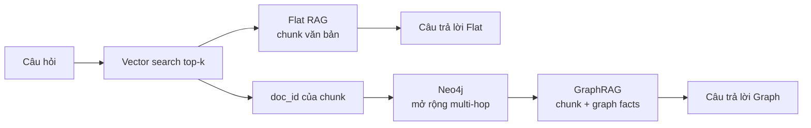
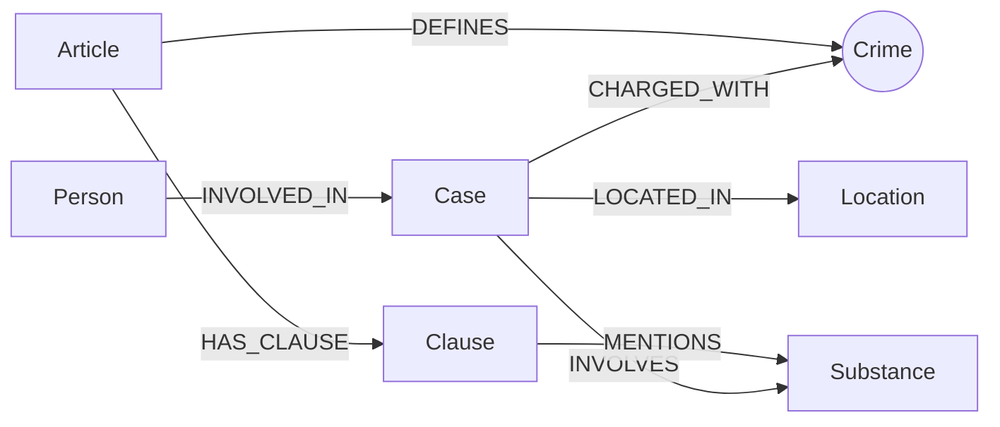

# Hướng dẫn thực hiện dự án Day 19 — Flat RAG và GraphRAG

> Tài liệu này được tổng hợp sau khi đọc `README.md`, `LAB_GUIDE.md`, `SUBMISSION.md`, mã nguồn trong `src/`, bộ kiểm thử, benchmark và dữ liệu hiện có. Dùng các ô `- [ ]` để theo dõi tiến độ; chỉ đánh dấu khi đạt đúng tiêu chí hoàn thành của checkpoint.

## 1. Kết quả cuối cùng cần đạt

Dự án yêu cầu xây và so sánh hai pipeline hỏi đáp trên cùng một kho dữ liệu:



Hai kho tri thức gồm:

- `data/drug_law/`: 18 văn bản luật, cấu trúc đều theo Điều → khoản → điểm.
- `data/drug_news/`: 20 bài báo, văn xuôi tự do về người, vụ việc, tội danh, chất, khối lượng và mức án.
- `data/benchmark_kg.json`: 6 câu hỏi dùng để so Flat RAG với GraphRAG.

Mục tiêu kỹ thuật là dùng một node cầu nối để đi từ dữ liệu báo chí sang căn cứ pháp luật. Với ontology gợi ý, node cầu nối là `Crime`:



Đầu ra bắt buộc khi nộp:

- `src/graph.py` hoàn thành KG-1 đến KG-4.
- `report/ONTOLOGY.md` mô tả đúng graph thực tế.
- `ket_qua_benchmark_kg.txt` sinh bằng `python bench_kg.py --judge`.
- `report/REPORT_KG.md` hoàn chỉnh và khớp số liệu benchmark.
- Ba ảnh tự chụp trong `report/img/`: `kg_count.png`, `kg_cross_kb.png`, `kg_my_case.png`.
- `pytest tests/ -q` đạt `48 passed`.
- `python bench_kg.py --check` có đủ 7 dòng `[OK]` và không có `[LỖI ...]`.

## 2. Trạng thái dự án tại thời điểm rà soát

Ngày rà soát: **05/10/2026**.

| Hạng mục  | Trạng thái hiện tại                                              | Việc còn làm                                 |
| --------- | ---------------------------------------------------------------- | -------------------------------------------- |
| Dữ liệu   | Đã có 18 file luật, 20 file tin và 6 câu benchmark               | Không cần crawl lại nếu dữ liệu không bị xóa |
| Base RAG  | Mã nguồn đã có sẵn trong`chunking.py`, `store.py`, `agent.py`    | Không sửa nếu không thật sự cần              |
| KG-1      | `link_entity` còn `NotImplementedError`                          | Phải cài đặt và đạt 5 test                   |
| KG-2      | `build_graph` còn `NotImplementedError`                          | Phải dựng cả hai KB vào Neo4j                |
| KG-3      | `Neo4jGraph.context` còn `NotImplementedError`                   | Phải truy vấn multi-hop và trả`list[str]`    |
| KG-4      | `GraphRAGAgent.answer` còn `NotImplementedError`                 | Phải ghép chunk + graph facts vào prompt     |
| Ontology  | `report/ONTOLOGY.md` vẫn là template                             | Phải điền đủ 8 mục và khớp graph thật        |
| Báo cáo   | `report/REPORT_KG.md` vẫn là template                            | Chỉ điền số liệu sau benchmark cuối          |
| Benchmark | Chưa có`ket_qua_benchmark_kg.txt`                                | Chạy`--judge` sau khi code ổn định           |
| Ảnh nộp   | Chưa có ba ảnh bắt buộc                                          | Chụp trên Neo4j Browser sau graph đầy đủ     |
| Python    | Cả lệnh`python` và `py` chưa khả dụng trong terminal lúc rà soát | Cài Python 3.11 hoặc sửa`PATH`               |
| Neo4j/API | Có Docker CLI nhưng Docker daemon chưa chạy; `.env` đã được tạo cho MWAPI nhưng chưa có key | Mở Docker Desktop và điền MWAPI + embedding key |

Do Python chưa khả dụng nên chưa thể xác nhận số test đang pass. Theo mã nguồn hiện tại, 7 test graph chắc chắn chưa thể pass vì KG-1 và KG-4 còn `NotImplementedError`.

## 3. Thứ tự thực hiện và checklist tổng

Các bước có phụ thuộc lẫn nhau, nên làm đúng thứ tự sau:

- [x] **CP0 — Bảo vệ repo:** không sửa test/benchmark, không commit secret.
- [x] **CP1 — Setup:** Python, virtual environment, dependencies, Docker, Neo4j và API key hoạt động.
- [x] **CP2 — Hiểu dữ liệu:** đọc các mẫu luật/tin và phân tích Q1–Q6.
- [x] **CP3 — Thiết kế ontology:** hoàn thiện `report/ONTOLOGY.md` trước khi code graph.
- [x] **CP4 — KG-1:** hoàn thành `link_entity`; đạt `5 passed`.
- [x] **CP5 — KG-2:** hoàn thành `build_graph`; graph nhỏ có đường nối xuyên hai KB.
- [x] **CP6 — KG-3:** hoàn thành truy vấn context multi-hop; context của Lê Minh Thành chứa Điều 251.
- [x] **CP7 — KG-4:** hoàn thành agent; toàn bộ test đạt `48 passed`.
- [x] **CP8 — Self-check:** `bench_kg.py --check` có đủ 7 `[OK]`.
- [x] **CP9 — Benchmark:** chạy `--judge`, đọc từng câu trả lời và lưu file kết quả cuối.
- [x] **CP10 — Kiểm tra graph:** chạy Cypher, chụp 3 ảnh và thu bằng chứng cho ít nhất 2 lỗi.
- [x] **CP11 — Báo cáo:** hoàn thiện `REPORT_KG.md`, số liệu khớp benchmark.
- [ ] **CP12 — Kiểm tra nộp bài:** secret sạch, đủ file, đúng tên repo, push và nộp link.

Khuyến nghị: hoàn thành ontology gợi ý để đạt đủ điểm chuẩn trước. Chỉ làm nhánh ontology tự thiết kế để lấy bonus khi pipeline chuẩn đã ổn định, vì code, Cypher, ảnh và báo cáo đều phải đổi theo ontology mới.

---

## CP0 — Bảo vệ repo và phạm vi chỉnh sửa

### Việc cần làm

- [x] Không sửa `tests/` để làm test pass.
- [x] Không sửa `bench_kg.py` để làm `--check` pass.
- [x] Không commit `.env`, API key hoặc `.venv/`.
- [x] Hạn chế sửa base RAG: `src/chunking.py`, `src/store.py`, `src/agent.py`.
- [x] Trước mỗi nhóm thay đổi, xem `git status` và `git diff`.

### Lý do

Thang điểm chấm trực tiếp hợp đồng trong `src/graph.py`. Sửa test hoặc benchmark làm các mục code bị 0 điểm. `.env` đã được `.gitignore`, nhưng vẫn phải kiểm tra để tránh key xuất hiện trong file khác hoặc lịch sử Git.

### Lệnh kiểm tra

```powershell
git status --short
git diff -- src/graph.py report/ONTOLOGY.md report/REPORT_KG.md
```

---

## CP1 — Setup môi trường

### 1.1. Cài và kiểm tra Python 3.11

Hiện terminal chưa nhận `python` hoặc `py`. Cài Python 3.11 và chọn **Add Python to PATH**, sau đó mở terminal mới:

```powershell
py -3.11 --version
```

Nếu máy chỉ có lệnh `python`, có thể thay mọi lệnh `py -3.11` bên dưới bằng `python`, nhưng phải xác nhận phiên bản là 3.11.

### 1.2. Tạo môi trường ảo và cài thư viện

```powershell
py -3.11 -m venv .venv
.\.venv\Scripts\Activate.ps1
.\.venv\Scripts\python.exe -m pip install -r requirements.txt
$env:PYTHONIOENCODING = "utf-8"
```

Nếu PowerShell chặn script kích hoạt, có thể chạy Python trực tiếp qua `.venv\Scripts\python.exe` thay vì đổi execution policy toàn máy:

```powershell
.\.venv\Scripts\python.exe -m pip install -r requirements.txt
.\.venv\Scripts\python.exe -m pytest tests/test_base.py -q
```

### 1.3. Tạo cấu hình môi trường

```powershell
Copy-Item .env.example .env
```

Mở `.env` và điền MWAPI key cùng một key cho embedding. Dự án đã được cấu hình sẵn như sau:

```dotenv
LLM_PROVIDER=mwapi
MWAPI_API_KEY=<key-MWAPI-của-bạn>
MWAPI_BASE_URL=https://api.mwapi.dev
MWAPI_CHAT_MODEL=claude-haiku-4-5-20251001
MWAPI_MAX_TOKENS=4096
MWAPI_PRICE_MULTIPLIER=5

EMBEDDING_PROVIDER=gemini
GEMINI_API_KEY=<key-Gemini-của-bạn>

NEO4J_URI=bolt://localhost:7687
NEO4J_USER=neo4j
NEO4J_PASSWORD=password123
```

MWAPI được dùng cho chat qua chuẩn Anthropic `/v1/messages`; Gemini có thể được thay bằng OpenAI hoặc OpenRouter cho embedding. Kiểm tra riêng MWAPI bằng `python scripts/check_mwapi.py`. Không dán key vào mã nguồn, báo cáo, ảnh hoặc tin nhắn commit.

### 1.4. Khởi động Neo4j bằng Docker

Mở Docker Desktop và chờ engine chạy. Lần đầu tạo container:

```powershell
docker run -d --name neo4j-drug-kg -p 7474:7474 -p 7687:7687 -e NEO4J_AUTH=neo4j/password123 neo4j:5
```

Những lần sau:

```powershell
docker start neo4j-drug-kg
docker ps
```

Mở `http://localhost:7474`, đăng nhập `neo4j` / `password123`.

### 1.5. Kiểm tra checkpoint

```powershell
.\.venv\Scripts\python.exe -m pytest tests/test_base.py -q
```

### Hoàn thành khi

- [x] Python báo đúng phiên bản 3.11.
- [x] Dependencies cài không lỗi.
- [x] `tests/test_base.py` báo `41 passed`.
- [x] `docker ps` thấy `neo4j-drug-kg` có trạng thái `Up`.
- [x] Đăng nhập Neo4j Browser thành công.
- [x] `.env` tồn tại cục bộ nhưng `git status` không liệt kê file này.

---

## CP2 — Hiểu dữ liệu và sáu câu benchmark

### File cần đọc

- [x] `data/drug_law/blhs-dieu-251.md`: nhận diện tiêu đề, khoản, điểm, khung hình phạt và tên chất.
- [x] `data/drug_news/news-100260918080821054.md`: Lê Minh Thành, 36 tháng tù, tội mua bán trái phép chất ma túy.
- [x] `data/drug_news/news-100260920221957595.md`: Hoàng Nato, hành vi tổ chức sử dụng trái phép chất ma túy.
- [x] `data/drug_news/news-100260917203001265.md`: Cái Quang Huy, MDMA, Ketamine và khối lượng.
- [x] `data/drug_news/news-100260928173914514.md`: hai bị cáo nhận án tử hình.
- [x] `data/benchmark_kg.json`: đọc `question`, `gold`, `must_include` của Q1–Q6.

### Bản đồ nhu cầu dữ liệu

| Câu | Loại                 | Dữ liệu cần                                    | Đường trả lời dự kiến                                                      |
| --- | -------------------- | ---------------------------------------------- | -------------------------------------------------------------------------- |
| Q1  | `single-hop-law`     | Định nghĩa tiền chất trong Luật PCMT           | Vector chunk luật là đủ; graph có thể bổ sung`Article/Clause`              |
| Q2  | `single-hop-news`    | Trần Thanh Tuấn và Trần Minh Tâm               | Vector chunk tin hoặc`Person → Case`                                       |
| Q3  | `cross-kb`           | 36 tháng + tội danh + Điều 251 + khoản 1       | `Person → Case → Crime ← Article → Clause`                                 |
| Q4  | `cross-kb`           | Hoàng Nato + Điều 255 + mức phạt cao nhất      | Alias/người → vụ → tội → Điều; phải lấy cả khoản cao nhất khi hỏi “tối đa” |
| Q5  | `cross-kb-multi-hop` | Cái Quang Huy + MDMA 9,6 kg + Điều 250 khoản 4 | Người → vụ → tội → Điều → khoản; nối vụ/chất với khoản/chất                |
| Q6  | `aggregation`        | Tất cả vụ có MDMA                              | `Substance {name:'MDMA'} ← INVOLVES ← Case`, rồi lấy tên/tóm tắt vụ        |

### Hoàn thành khi

- [x] Giải thích được vì sao Q3–Q5 không thể tin cậy chỉ bằng một chunk.
- [x] Chỉ ra `Crime` là dữ liệu xuất hiện ở cả hai KB và có thể làm cầu nối.
- [x] Biết Q6 cần truy vấn tổng hợp nhiều vụ, không chỉ lấy một bài gần nhất.

---

## CP3 — Thiết kế và ghi ontology

### Lựa chọn an toàn cho điểm chuẩn

Dùng ontology gợi ý đã có helper trong `src/graph.py`:

| Label       | Khóa`MERGE`      | Thuộc tính quan trọng                       | Nguồn                      |
| ----------- | ---------------- | ------------------------------------------- | -------------------------- |
| `Article`   | `id`             | `title`, `law`, `doc_id`                    | Luật, regex                |
| `Clause`    | `id`             | `number`, `penalty`, `text`, `doc_id`       | Luật, regex                |
| `Crime`     | `name` chuẩn hóa | `name`                                      | Cả hai KB, node dùng chung |
| `Case`      | `name`           | `summary`, `date`, `doc_id`, `source_title` | Tin, LLM                   |
| `Person`    | `name`           | `aliases`                                   | Tin, LLM                   |
| `Substance` | `name`           | `name`                                      | Cả hai KB                  |
| `Location`  | `name`           | `name`                                      | Tin, LLM                   |

| Quan hệ        | Hướng                | Thuộc tính                   |
| -------------- | -------------------- | ---------------------------- |
| `DEFINES`      | `Article → Crime`    | Không                        |
| `HAS_CLAUSE`   | `Article → Clause`   | Không                        |
| `MENTIONS`     | `Clause → Substance` | Không                        |
| `CHARGED_WITH` | `Case → Crime`       | Không                        |
| `INVOLVES`     | `Case → Substance`   | `amount`                     |
| `LOCATED_IN`   | `Case → Location`    | Không                        |
| `INVOLVED_IN`  | `Person → Case`      | `role`, `sentence`, `charge` |

### Cách điền `report/ONTOLOGY.md`

1. Đánh dấu “Dùng ontology gợi ý”.
2. Vẽ đúng sơ đồ label/relationship sẽ được code tạo ra.
3. Điền đủ bảng entity và relationship ở trên bằng lời của mình.
4. Mô tả node cầu nối `Crime`:
   - luật tạo tên chuẩn từ tiêu đề Điều;
   - tin được LLM trích xuất rồi đưa qua `link_entity`;
   - cầu gãy khi tên tội không được chuẩn hóa, LLM chọn ngoài danh sách hoặc tin không nêu tội.
5. Ghi đường đi cho cả Q1–Q6, dựa trên bảng ở CP2.
6. Ghi ít nhất 3 quyết định và đánh đổi, ví dụ:
   - dùng regex cho luật thay vì LLM: rẻ/ổn định nhưng phụ thuộc cấu trúc văn bản;
   - mức án là property trên `INVOLVED_IN`: truy vấn người-vụ thuận tiện nhưng khó biểu diễn nhiều lần xét xử;
   - `Crime` làm cầu nối: trực quan nhưng rất nhạy với chuẩn hóa tên;
   - tách `Clause`: truy vấn khung phạt tốt hơn nhưng tăng node và độ dài context.
7. Ghi hạn chế còn lại: khóa tên do LLM tạo dễ trùng; chất đồng nghĩa chưa gộp; chưa mô hình hóa ngưỡng khối lượng; chưa tách giai đoạn tố tụng.

Nếu tự thiết kế để lấy bonus, phải có khác biệt có mục đích, code graph thật phải đúng bản thiết kế, điền mục 7 và nộp thêm `ket_qua_benchmark_kg.hint.txt` làm đối chứng.

### Hoàn thành khi

- [x] `report/ONTOLOGY.md` có đủ 8 mục.
- [x] Mọi label và relationship mô tả đều sẽ thực sự được tạo trong code.
- [x] Q1–Q6 đều có đường đi hoặc có giải thích rõ câu không hỗ trợ.
- [x] Có ít nhất 3 quyết định kèm phương án thay thế và đánh đổi.

---

## CP4 — Cài đặt KG-1 `link_entity`

### Mục tiêu

Map cách viết tự do trong báo về đúng một tên chuẩn trong `known`, nhưng không nối bừa tên không liên quan.

Ví dụ:

- `"Tội Mua bán trái phép chất ma túy"` → `"mua bán trái phép chất ma túy"`.
- `"vận chuyển trái phép chất ma tuý"` → `"vận chuyển trái phép chất ma túy"`.
- `"lừa đảo chiếm đoạt tài sản"` → `None`.

### Thuật toán cần cài trong `src/graph.py`

1. Nếu `name` rỗng hoặc `known` rỗng, trả `None`.
2. Chuẩn hóa `name` bằng hàm `normalize` được truyền vào.
3. Chuẩn hóa từng phần tử của `known`, nhưng giữ lại chuỗi gốc.
4. Nếu khớp chính xác sau chuẩn hóa, trả chuỗi gốc tương ứng trong `known`.
5. Nếu chưa khớp, gọi `difflib.get_close_matches(..., n=1, cutoff=0.8)` trên danh sách đã chuẩn hóa.
6. Nếu có kết quả gần nhất, tìm đúng vị trí và trả cách viết gốc trong `known`; nếu không, trả `None`.

Pseudo-code:

```python
if not name or not known:
    return None

target = normalize(name)
normalized_known = [normalize(item) for item in known]

for original, normalized in zip(known, normalized_known):
    if target == normalized:
        return original

matches = difflib.get_close_matches(target, normalized_known, n=1, cutoff=0.8)
if not matches:
    return None
return known[normalized_known.index(matches[0])]
```

### Kiểm tra

```powershell
.\.venv\Scripts\python.exe -m pytest tests/test_graph.py -k LinkEntity -v
```

### Hoàn thành khi

- [x] Có `5 passed`.
- [x] Hàm trả cách viết gốc từ `known`, không trả chuỗi đã normalize.
- [x] Tên không liên quan trả `None`.
- [x] Không còn `NotImplementedError` của KG-1.

---

## CP5 — Cài đặt KG-2 `build_graph`

### Mục tiêu

Dựng graph cho cả luật và tin. `bench_kg.py` đã gọi `graph.reset()` trước khi build, vì vậy không cần tự xóa graph trong `build_graph`.

### Cách làm theo ontology gợi ý

Các helper đã có sẵn:

- `parse_law_article`: trích luật bằng regex.
- `extract_news_cases`: gọi LLM ở JSON mode và chuẩn hóa tội danh.
- `suggested_constraints`: tạo unique constraints.
- `add_law_article`: ghi `Article`, `Clause`, `Crime`, `Substance` và cạnh luật.
- `add_news_case`: ghi `Case`, `Person`, `Location`, `Crime`, `Substance` và cạnh tin.

Logic cần đặt trong `build_graph`:

```python
graph.suggested_constraints()

articles = [parse_law_article(doc) for doc in law_docs]
for article in articles:
    graph.add_law_article(article)

known_crimes = [article["crime"] for article in articles if article["crime"]]

for doc in news_docs:
    cases = extract_news_cases(
        doc,
        lambda prompt: llm_fn(prompt, json_mode=True),
        known_crimes,
    )
    for case in cases:
        graph.add_news_case(case, doc)
```

### Những điều phải kiểm soát

- Node sinh riêng từ một document phải có `doc_id = Document.id`.
- Node dùng chung như `Crime` và `Substance` có thể không có `doc_id`; không được gán một `doc_id` tùy ý khiến nguồn bị hiểu sai.
- Dùng `MERGE` theo khóa ổn định, không dùng `CREATE` cho entity dùng chung.
- Phải tạo constraint trước khi nạp dữ liệu.
- Luật dùng regex; chỉ tin tức gọi LLM.
- `llm_fn` của benchmark có tham số `json_mode=True`; phải bọc lambda đúng chữ ký như trên.

### Kiểm tra theo từng mức

1. Build nhỏ trước:

```powershell
.\.venv\Scripts\python.exe bench_kg.py --build --limit 2
```

2. Trong Neo4j Browser, kiểm tra label:

```cypher
MATCH (n)
RETURN labels(n)[0] AS label, count(*) AS n
ORDER BY n DESC;
```

3. Kiểm tra dữ liệu của bài Lê Minh Thành:

```cypher
MATCH (n {doc_id:'news-100260918080821054'})-[r]-(x)
RETURN n, r, x;
```

4. Kiểm tra đường nối hai KB:

```cypher
MATCH (a), (b)
WHERE a.doc_id STARTS WITH 'blhs-'
  AND b.doc_id STARTS WITH 'news-'
MATCH p = shortestPath((a)-[*..4]-(b))
RETURN p
LIMIT 5;
```

### Hoàn thành khi

- [x] Có đủ label/relationship đúng với `ONTOLOGY.md`.
- [x] Có node mang `doc_id` của cả luật và tin.
- [x] Bài Lê Minh Thành tạo được `Person`, `Case`, `Crime` liên quan.
- [x] Có ít nhất một đường dài không quá 4 cạnh nối node luật và node tin.
- [x] Không còn `NotImplementedError` của KG-2.

---

## CP6 — Cài đặt KG-3 `Neo4jGraph.context`

### Mục tiêu

Nhận `question` và danh sách `doc_ids` từ vector search, sau đó trả `list[str]` gồm các dữ kiện dễ đọc. Đây là phần tạo khác biệt chính giữa Flat RAG và GraphRAG.

### Quy trình cài đặt

#### Bước A — Lấy seed và dữ kiện một bước

```python
seed_ids, facts = self.seed_facts(question, doc_ids)
```

`seed_facts` đã tìm node theo `doc_id`, tên hoặc alias xuất hiện trong câu hỏi và lấy các cạnh một bước quanh seed.

#### Bước B — Tìm các vụ án liên quan seed

Thử Cypher trong Neo4j Browser trước, rồi đưa vào `self.run`:

```cypher
MATCH (k:Case)
WHERE elementId(k) IN $ids
   OR EXISTS {
       MATCH (s)--(k)
       WHERE elementId(s) IN $ids
   }
RETURN DISTINCT elementId(k) AS id,
       k.name AS name,
       k.summary AS summary;
```

Với mỗi dòng, thêm một fact như:

```text
Vụ việc '...': ...
```

#### Bước C — Đi từ vụ án sang căn cứ luật

Đường multi-hop chính:

```text
(Case)-[:CHARGED_WITH]->(Crime)<-[:DEFINES]-(Article)-[:HAS_CLAUSE]->(Clause)
```

Cypher khung:

```cypher
MATCH (k:Case)-[:CHARGED_WITH]->(:Crime)<-[:DEFINES]-(a:Article)-[:HAS_CLAUSE]->(cl:Clause)
WHERE elementId(k) IN $case_ids
  AND (
      cl.number = 1
      OR EXISTS {
          MATCH (k)-[:INVOLVES]->(:Substance)<-[:MENTIONS]-(cl)
      }
      OR $need_maximum = true
  )
RETURN DISTINCT a.id AS article_id,
       a.title AS title,
       cl.number AS number,
       cl.text AS text
ORDER BY article_id, number;
```

Trong Python, `need_maximum` nên là `True` khi câu hỏi chứa ý như `"tối đa"`, `"cao nhất"`, `"chung thân"` hoặc `"tử hình"`. Khi đó cần đưa các khoản cao hơn vào context; nếu chỉ lấy khoản 1 thì Q4 sẽ trả sai mức phạt tối đa.

Q5 cần các khoản có cùng `Substance` với vụ để LLM đối chiếu `amount` trong cạnh `INVOLVES` với ngưỡng viết trong `Clause.text`. Ontology gợi ý chưa biến ngưỡng thành số có cấu trúc, nên phải đưa nguyên văn các khoản liên quan vào prompt.

#### Bước D — Xử lý câu hỏi nhắc trực tiếp Điều luật

Lấy số Điều:

```python
article_numbers = re.findall(r"[Đđ]iều\s+(\d+)", question)
question_substances = find_substances(question)
```

Sau đó truy vấn `Article → Clause`, ưu tiên:

- khoản 1;
- khoản nhắc tới chất có trong câu hỏi;
- toàn bộ khoản khi câu hỏi hỏi mức tối đa/cao nhất.

#### Bước E — Chuẩn hóa fact trả về

Mỗi khoản nên có định dạng nhất quán:

```python
facts.append(f"[{article_id} - {title}] khoản {number}: {text}")
```

Cuối hàm:

1. Loại fact trùng nhưng giữ nguyên thứ tự.
2. Giới hạn tối đa `max_facts`.
3. Luôn trả `list[str]`, kể cả khi rỗng.

Ví dụ:

```python
unique_facts = list(dict.fromkeys(facts))
return unique_facts[:max_facts]
```

### Tình huống phải tự kiểm

- Q3: fact có `36 tháng`, tội danh và `Điều 251`, khoản 1.
- Q4: context có `Điều 255` và khoản cao nhất chứa `tù chung thân`.
- Q5: context có `Điều 250`, khoản 4 và nguyên văn ngưỡng MDMA từ 100 gam trở lên.
- Q6: seed theo tên `MDMA` phải mở rộng đến nhiều `Case`, không chỉ một bài top-k.

### Kiểm tra

```powershell
.\.venv\Scripts\python.exe bench_kg.py --check
```

### Hoàn thành khi

- [x] Có `[OK] KG-2 build_graph ...`.
- [x] Có `[OK] KG-3 context: ... có Điều 251`.
- [x] `context()` trả dữ kiện đọc được, không trả record Neo4j thô.
- [x] Số facts không vượt `max_facts`.
- [x] Không còn `NotImplementedError` của KG-3.

---

## CP7 — Cài đặt KG-4 `GraphRAGAgent.answer`

### Mục tiêu

Giữ nguyên context của Flat RAG và bổ sung facts từ graph trước khi gọi LLM.

### Trình tự bắt buộc

1. Tìm top-k chunk giống `KnowledgeBaseAgent.answer`:

   ```python
   chunks = self.store.search(question, top_k=top_k)
   ```

2. Lấy `doc_id` không trùng:

   ```python
   doc_ids = list(dict.fromkeys(
       chunk["metadata"]["doc_id"] for chunk in chunks
   ))
   ```

3. Gọi graph:

   ```python
   facts = self.graph.context(question, doc_ids)
   ```

4. Ghép chuỗi:

   ```python
   facts_text = "\n".join(f"- {fact}" for fact in facts)
   chunks_text = "\n\n".join(
       f"[{index}] {chunk['content']}"
       for index, chunk in enumerate(chunks, start=1)
   )
   ```

5. Điền `GRAPH_PROMPT` với `facts`, `chunks`, `question` và trả kết quả `self.llm_fn(prompt)`.

### Kiểm tra

```powershell
.\.venv\Scripts\python.exe -m pytest tests/test_graph.py -k GraphRAGAgent -v
.\.venv\Scripts\python.exe -m pytest tests/ -q
```

### Hoàn thành khi

- [x] Hai test `GraphRAGAgent` pass.
- [x] Toàn bộ test báo `48 passed`.
- [x] Prompt có đồng thời fact `Điều 251`, chunk `36 tháng` và nguyên văn câu hỏi.
- [x] Không còn `raise NotImplementedError` trong `src/graph.py`.

Kiểm tra nhanh:

```powershell
rg -n "raise NotImplementedError|TODO KG-" src/graph.py
```

Các comment mô tả TODO có thể còn, nhưng không được còn lệnh `raise NotImplementedError`.

---

## CP8 — Chạy self-check toàn hệ thống

### Lệnh

```powershell
.\.venv\Scripts\python.exe bench_kg.py --check
```

Lệnh này sẽ xóa graph hiện tại và chỉ dựng **18 luật + 1 bài tin** về Lê Minh Thành. Nó kiểm tra theo hợp đồng, không phụ thuộc tên label của ontology.

### Bảy dòng `[OK]` dự kiến

- [x] Dữ liệu: 18 điều luật, 20 bài báo.
- [x] KG-1 `link_entity`.
- [x] Neo4j kết nối được.
- [x] KG-2 `build_graph`, có node/cạnh và đường xuyên hai KB.
- [x] KG-3 `context`, có Điều 251.
- [x] KG-4 `GraphRAGAgent.answer`.
- [x] Chi phí check.

### Hoàn thành khi

- [x] Có đủ 7 `[OK]`.
- [x] Không có `[LỖI ...]`.
- [x] Provider chat/embedding in ra đúng provider dự định dùng.

> Không chụp ảnh nộp bài ngay sau `--check`, vì graph lúc này chỉ có một bài báo.

---

## CP9 — Chạy benchmark chính thức

### Trước khi chạy

- [x] `48 passed`.
- [x] `--check` đạt 7 `[OK]`.
- [x] Đã chốt code và ontology.
- [x] API key còn quota.
- [x] Docker/Neo4j đang chạy.

### Lệnh chính thức

```powershell
.\.venv\Scripts\python.exe bench_kg.py --judge
```

Lệnh sẽ:

1. embed toàn bộ chunk cho vector store;
2. xóa graph cũ và dựng graph đầy đủ từ 18 luật + 20 bài báo;
3. chạy Q1–Q6 qua Flat RAG và GraphRAG;
4. chấm từng câu bằng LLM-as-judge;
5. sinh `ket_qua_benchmark_kg.txt`.

### Kiểm tra file kết quả

- [x] Dòng đầu có model chat, model embedding, `top_k`, `chunk_size`, số chunk, node và relationship.
- [x] Có phần `== Indexing (one-off)`.
- [x] Có phần `== Querying (mean per question)`.
- [x] Có phần `== Per question`.
- [x] Từng Q1–Q6 có cả `flat` và `graph`.
- [x] Cột `judge` là số, không phải `-`.
- [x] Đọc nguyên văn 12 câu trả lời; không chỉ nhìn số trung bình.
- [x] Các câu cross-KB Q3–Q5 có xu hướng GraphRAG recall tốt hơn Flat RAG; nếu không, kiểm tra bridge và KG-3.

### Bẫy cần tránh

- Mỗi lần chạy benchmark đều xóa và dựng lại graph.
- Chạy lại `--check` sau `--judge` sẽ thay graph đầy đủ bằng graph chỉ có một bài tin.
- Không sửa tay `ket_qua_benchmark_kg.txt`; mọi số liệu phải sinh từ code trong repo.
- Không trộn kết quả của nhiều provider vào cùng một bảng báo cáo.

### Hoàn thành khi

- [x] File `ket_qua_benchmark_kg.txt` tồn tại và đủ 3 phần.
- [x] Kết quả được sinh từ phiên bản code cuối cùng.
- [x] Graph đầy đủ vẫn còn trong Neo4j để làm CP10.

---

## CP10 — Kiểm tra graph, chụp ảnh và tìm lỗi

### 10.1. Kiểm tra graph đầy đủ

Nếu graph không còn đầy đủ, chạy:

```powershell
.\.venv\Scripts\python.exe bench_kg.py --build
```

#### Q-A — Đếm node

```cypher
MATCH (n)
RETURN labels(n)[0] AS label, count(*) AS n
ORDER BY n DESC;
```

Kết quả phải có đủ label trong `ONTOLOGY.md`. Với ontology gợi ý, `Article = 18`, `Crime = 13`; các loại trích từ tin có thể dao động theo LLM.

#### Q-B — Đường nối hai KB

```cypher
MATCH p=(:Person)-[:INVOLVED_IN]->(:Case)-[:CHARGED_WITH]->(:Crime)<-[:DEFINES]-(:Article)
RETURN p
LIMIT 25;
```

Phải thấy `Person`, `Case`, `Crime`, `Article` và ba loại cạnh trên đường đi.

#### Q-C — Một Điều luật

```cypher
MATCH p=(:Article {id:'Điều 251 BLHS'})-[:HAS_CLAUSE]->(:Clause)-[:MENTIONS]->(:Substance)
RETURN p;
```

#### Q-D — Một vụ xuyên suốt

```cypher
MATCH p=(:Person {name:'Lê Minh Thành'})-[:INVOLVED_IN]->(k:Case)-[:CHARGED_WITH]->(:Crime)<-[:DEFINES]-(:Article)
OPTIONAL MATCH q=(k)-[:INVOLVES|LOCATED_IN]->()
RETURN p, q;
```

Khi chụp ảnh `kg_my_case.png`, phải thay Lê Minh Thành bằng **một người khác** lấy từ kết quả Q-B.

### 10.2. Chụp ba ảnh bắt buộc

Trước mỗi ảnh chạy `:clear`. Ảnh phải chụp cả cửa sổ trình duyệt, thấy ô truy vấn và Results overview, không cắt/chỉnh sửa.

Tạo thư mục đích nếu chưa có:

```powershell
New-Item -ItemType Directory -Force report\img
```

- [x] `report/img/kg_count.png`: Q-A, bảng đọc được đủ label và số lượng.
- [x] `report/img/kg_cross_kb.png`: Q-B, tab Graph và Results overview thấy cầu nối.
- [x] `report/img/kg_my_case.png`: Q-D với người tự chọn, không phải Lê Minh Thành.
- [x] Ghi tên người đã chọn vào `report/REPORT_KG.md`.

### 10.3. Thu bằng chứng cho ít nhất hai nhóm lỗi

Mỗi lỗi phải có đủ: hiện tượng, bằng chứng, nguyên nhân, đề xuất sửa và đánh đổi.

| Mã                       | Cách tìm nhanh                                                                                  |
| ------------------------ | ----------------------------------------------------------------------------------------------- |
| E1 — Cầu nối gãy         | `MATCH (k:Case) WHERE NOT (k)-[:CHARGED_WITH]->() RETURN k.name, k.doc_id`                      |
| E2 — Thiếu ngữ cảnh luật | So câu hỏi mức phạt tối đa với các khoản thực sự được KG-3 đưa vào prompt                       |
| E3 — Trùng thực thể      | `MATCH (s:Substance) RETURN s.name ORDER BY toLower(s.name)`; làm tương tự với `Case`, `Person` |
| E4 — Phép đo sai         | Tìm câu có`recall` và `judge` mâu thuẫn; so với `must_include`                                  |
| E5 — LLM lệch graph      | Viết Cypher trả lời Q6 trực tiếp rồi so câu trả lời GraphRAG                                    |
| E6 — Thuộc tính thiếu    | `MATCH (p:Person)-[r:INVOLVED_IN]->(k) WHERE r.charge = '' RETURN p.name, r.role, k.name`       |

Truy vấn hữu ích cho Q6/E5:

```cypher
MATCH (k:Case)-[:INVOLVES]->(s:Substance)
WHERE toLower(s.name) = 'mdma'
RETURN DISTINCT k.name, k.summary, k.doc_id;
```

### Hoàn thành khi

- [x] Ba ảnh đúng tên và đúng quy cách.
- [x] Có ít nhất hai lỗi E1–E6 với bằng chứng có thể kiểm chứng.
- [x] Mỗi bằng chứng Cypher có cả câu truy vấn và kết quả trả về.

---

## CP11 — Hoàn thiện báo cáo

### 11.1. `report/ONTOLOGY.md`

Sau khi graph đã chạy, đối chiếu thiết kế với graph thật:

```cypher
MATCH (n) RETURN DISTINCT labels(n);
```

```cypher
MATCH ()-[r]->() RETURN DISTINCT type(r);
```

Nếu khác, sửa code hoặc sửa tài liệu cho khớp. Không mô tả entity/relationship không tồn tại.

### 11.2. `report/REPORT_KG.md`

Điền theo thứ tự:

1. Copy nguyên hai bảng `Indexing` và `Querying` từ benchmark.
2. Tính `Graph / Flat` cho USD, thời gian và input token.
3. Điền Q1–Q6: recall, judge, bên thắng và lý do một câu.
4. Viết ít nhất hai phân tích lỗi, mỗi lỗi đủ bốn phần và có bằng chứng.
5. Kết luận khi nào KG đáng dùng dựa trên số liệu thật.
6. Dán output `pytest tests/ -q` và `bench_kg.py --check`.
7. Ghi tên người dùng cho ảnh `kg_my_case.png`.

Nếu phân tích điểm hòa vốn chi phí:

```text
Chi phí dựng thêm = Graph indexing - Flat indexing
Tiết kiệm mỗi câu = Flat query - Graph query
Số câu hòa vốn = Chi phí dựng thêm / Tiết kiệm mỗi câu
```

Nếu Graph query đắt hơn Flat query thì không có điểm hòa vốn thuần chi phí; lợi ích cần được biện minh bằng độ chính xác/recall tăng lên.

### Hoàn thành khi

- [x] Số node/cạnh/chunk/model trong báo cáo khớp file benchmark.
- [x] Hai bảng chi phí và bảng Q1–Q6 đầy đủ.
- [x] Ít nhất hai lỗi có bằng chứng, nguyên nhân và cách sửa cụ thể.
- [x] Kết luận có dẫn số liệu, không chỉ nêu cảm tính.
- [x] Output test/check được dán từ lần chạy code cuối.

---

## CP12 — Checklist cuối trước khi nộp

### Chạy lại theo thứ tự

```powershell
.\.venv\Scripts\python.exe -m pytest tests/ -q
.\.venv\Scripts\python.exe bench_kg.py --check
.\.venv\Scripts\python.exe bench_kg.py --judge
git status
```

Sau `--judge`, nếu cần chụp lại ảnh thì chụp ngay trên graph đầy đủ. Không chạy `--check` lần nữa trước khi chụp.

### Kiểm tra file

- [x] `src/graph.py` không còn `raise NotImplementedError`.
- [x] `report/ONTOLOGY.md` đủ nội dung và khớp graph thật.
- [x] `ket_qua_benchmark_kg.txt` có judge và đủ 3 phần.
- [x] `report/REPORT_KG.md` đủ 5 mục chính.
- [x] Có `report/img/kg_count.png`.
- [x] Có `report/img/kg_cross_kb.png`.
- [x] Có `report/img/kg_my_case.png`.
- [x] Không nộp ảnh mẫu trong `docs/img/` thay cho ảnh tự chụp.

### Kiểm tra secret và lịch sử Git

Trên PowerShell, tìm các mẫu key phổ biến trong file được Git theo dõi:

```powershell
git ls-files | Select-String -Pattern "^\.env$|\.venv"
git grep -n -E "sk-[A-Za-z0-9_-]+|OPENAI_API_KEY=.+|ANTHROPIC_API_KEY=.+|MWAPI_API_KEY=.+|GEMINI_API_KEY=.+"
```

Hai lệnh không được lộ key thật. Nếu key từng bị commit, phải thu hồi key ngay; xóa ở commit sau không làm key biến mất khỏi lịch sử.

### Điều kiện nộp

- [x] Test: `48 passed`.
- [x] Check: 7 `[OK]`, không có `[LỖI]`.
- [x] Repo có tên `K4-DAY19-HoVaTen-MSSV` theo yêu cầu môn học.
- [x] Đã commit và push phiên bản cuối lên repo GitHub cá nhân.
- [x] Đã xác nhận `origin/main` khớp commit local và repo không có secret.
- [ ] Đã nộp đúng link repo lên vLearn.
- [ ] Sau khi hoàn tất, có thể dừng Neo4j bằng `docker stop neo4j-drug-kg`.

---

## 4. Cách xử lý lỗi nhanh

| Hiện tượng                         | Kiểm tra và cách xử lý                                                                                    |
| ---------------------------------- | --------------------------------------------------------------------------------------------------------- |
| Terminal không nhận`python`/`py`   | Cài Python 3.11, chọn Add to PATH, mở terminal mới                                                        |
| `UnicodeEncodeError: charmap`      | Chạy`$env:PYTHONIOENCODING="utf-8"`                                                                       |
| Không kết nối Docker daemon        | Mở Docker Desktop và chờ engine chạy hoàn toàn                                                            |
| `port is already allocated`        | Dùng`docker ps -a` xác định container đang chiếm 7474/7687; không xóa nhầm container                      |
| Neo4j authentication fail          | Đồng bộ`NEO4J_PASSWORD` trong `.env` với mật khẩu lúc tạo container                                       |
| `ModuleNotFoundError`              | Kích hoạt đúng`.venv` và cài lại `requirements.txt`                                                       |
| Thiếu node tin                     | In JSON của một lần extraction; kiểm tra schema`cases` và `json_mode=True`                                |
| Có hai KB nhưng không nối          | Kiểm tra`link_entity`, `known_crimes`, `CHARGED_WITH` và `DEFINES`                                        |
| `context()` không có Điều 251      | Thử từng đoạn Cypher trong Neo4j Browser; kiểm tra`seed_ids` và đường `Case → Crime ← Article`            |
| Q4 trả khung cơ bản thay vì tối đa | Khi câu hỏi chứa “tối đa/cao nhất”, đưa các khoản cao hơn vào facts                                       |
| Q5 không chọn được khoản 4         | Đảm bảo facts có`amount`, `MDMA` và nguyên văn các khoản liên quan                                        |
| Q6 chỉ có một vụ MDMA              | Seed từ node`MDMA` và mở rộng đến tất cả `Case`; không phụ thuộc riêng top-k chunk                        |
| Graph Browser trống sau check      | `--check` chỉ dựng graph nhỏ; chạy lại `--build` hoặc `--judge`                                           |
| Base test fail                     | Xem`git diff` ở `chunking.py`, `store.py`, `agent.py`; hoàn tác đúng phần sửa nhầm, không reset toàn repo |

## 5. Chiến lược đạt điểm

Ưu tiên theo mức ảnh hưởng:

1. Đạt `48 passed` và 7 `[OK]`: phần code + giữ base không hỏng chiếm 30 điểm.
2. Hoàn chỉnh, đồng bộ `ONTOLOGY.md`: 15 điểm và là điều kiện xét bonus.
3. Sinh benchmark hợp lệ, không sửa tay: bảo vệ trực tiếp các mục chi phí, từng câu và kết luận.
4. Dành thời gian cho hai phân tích lỗi có bằng chứng: riêng phần này 20 điểm.
5. Chụp đúng ba ảnh, thấy truy vấn và Results overview: 5 điểm dễ mất nếu sai quy cách.
6. Chỉ làm bonus ontology riêng khi toàn bộ phần chuẩn đã ổn định.

Tài liệu nguồn cần đối chiếu khi có khác biệt:

- `README.md`: mục tiêu và kiến trúc tổng quan.
- `LAB_GUIDE.md`: trình tự thao tác, Cypher và xử lý lỗi.
- `SUBMISSION.md`: đầu ra, thang điểm và quy cách nộp.
- `src/graph.py`: hợp đồng kỹ thuật thực tế của KG-1 đến KG-4.
- `tests/test_graph.py`: điều kiện test offline cho KG-1 và KG-4.
- `bench_kg.py`: điều kiện self-check, benchmark và định dạng file kết quả.
