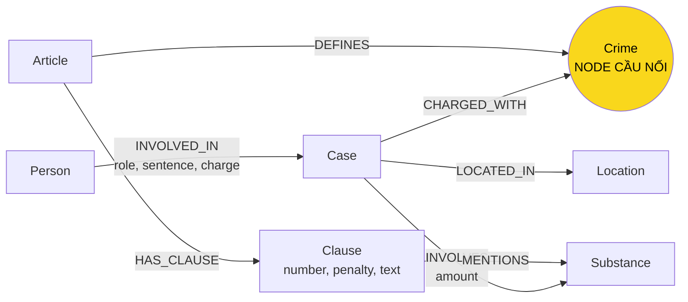

# Thiết kế Ontology — Day 19

**Họ tên:** Vũ Văn Diện

**MSSV:** 2A202602418

**Lựa chọn** (đánh dấu một):

- [x] Dùng ontology gợi ý, có bổ sung quy tắc lấy toàn bộ khoản khi câu hỏi hỏi mức phạt tối đa
- [ ] Tự thiết kế (xét bonus +15)

## 1. Sơ đồ

`Crime` là node cầu nối giữa KB tin tức và KB luật.

## 2. Entity types (node labels)

| Label | Ý nghĩa | Khóa định danh (`MERGE` theo) | Properties | Lấy từ KB nào | Trích bằng |
| --- | --- | --- | --- | --- | --- |
| `Article` | Một Điều luật | `id`, ví dụ `Điều 251 BLHS` | `id`, `title`, `law`, `doc_id` | Luật | Regex/front matter |
| `Clause` | Một khoản trong Điều luật | `id`, ví dụ `Điều 251 BLHS khoản 1` | `id`, `number`, `penalty`, `text`, `doc_id` | Luật | Regex |
| `Crime` | Tội danh chuẩn hóa | `name` | `name` | Luật và tin | Tiêu đề luật + LLM + `link_entity` |
| `Case` | Vụ việc/vụ án trong bài báo | `name` | `name`, `summary`, `date`, `doc_id`, `source_title` | Tin | LLM JSON |
| `Person` | Người tham gia vụ việc | `name` | `name`, `aliases` | Tin | LLM JSON |
| `Substance` | Chất ma túy | `name` | `name` | Luật và tin | Regex/danh sách chuẩn + LLM |
| `Location` | Địa điểm của vụ việc | `name` | `name` | Tin | LLM JSON |

`Article`, `Clause` và `Case` là các node sinh trực tiếp từ một tài liệu nên có `doc_id`. `Crime`, `Substance`, `Person` và `Location` có thể được dùng chung giữa nhiều tài liệu, vì vậy không ép chúng mang một `doc_id` duy nhất.

## 3. Relationships

| Type | Từ → Đến | Properties trên cạnh | Ý nghĩa |
| --- | --- | --- | --- |
| `DEFINES` | `Article → Crime` | Không | Điều luật định nghĩa tội danh |
| `HAS_CLAUSE` | `Article → Clause` | Không | Điều luật gồm các khoản |
| `MENTIONS` | `Clause → Substance` | Không | Khoản luật nhắc tới chất ma túy |
| `CHARGED_WITH` | `Case → Crime` | Không | Vụ việc liên quan/tố tụng theo tội danh |
| `INVOLVES` | `Case → Substance` | `amount` | Vụ việc có chất và khối lượng được nêu trong tin |
| `LOCATED_IN` | `Case → Location` | Không | Địa điểm xảy ra/xét xử vụ việc |
| `INVOLVED_IN` | `Person → Case` | `role`, `sentence`, `charge` | Vai trò, mức án và tội danh của người trong vụ |

## 4. Node cầu nối giữa hai KB

- **Node:** `Crime`.
- **Vì sao chọn:** phía luật có `Article-[:DEFINES]->Crime`; phía tin có `Case-[:CHARGED_WITH]->Crime`. Nhờ cùng một node `Crime`, truy vấn đi được từ người/vụ án trong báo sang Điều và khoản luật.
- **Cách bảo đảm hai phía khớp tên:** tên tội từ tiêu đề luật được chuẩn hóa bởi `normalize_crime`. Prompt trích xuất tin chứa danh sách tội danh chuẩn. Kết quả LLM tiếp tục đi qua `link_entity`: chuẩn hóa cả hai phía, khớp chính xác trước, sau đó fuzzy matching với ngưỡng `0.8`; hàm luôn trả lại cách viết gốc trong danh sách chuẩn.
- **Khi cầu gãy:** bài báo không nêu tội danh; LLM trả JSON sai/thiếu; tên tội quá khác danh sách chuẩn; hoặc tên được nối nhầm. Cách xử lý là kiểm tra JSON một bài, kiểm tra `Case` không có `CHARGED_WITH`, mở bài gốc theo `doc_id`, bổ sung alias/quy tắc normalize nhưng không hạ ngưỡng quá thấp vì nối sai nguy hiểm hơn không nối.

## 5. Competency questions

| Câu | Đường đi (Cypher pattern) | Trả lời được? |
| --- | --- | --- |
| Q1 | `(:Article {id:'Điều 2 Luật PCMT'})-[:HAS_CLAUSE]->(:Clause)`; hybrid GraphRAG vẫn giữ chunk luật từ vector search | Có |
| Q2 | `(:Person)-[r:INVOLVED_IN]->(:Case)` với `r.sentence`; lọc vụ có tiêu đề/tóm tắt đường dây 36 kg | Có nếu LLM trích đủ hai người và mức án |
| Q3 | `(:Person {name:'Lê Minh Thành'})-[r:INVOLVED_IN]->(:Case)-[:CHARGED_WITH]->(:Crime)<-[:DEFINES]-(:Article {id:'Điều 251 BLHS'})-[:HAS_CLAUSE]->(:Clause {number:1})` | Có |
| Q4 | `(:Person {aliases:'Hoàng Nato'})-[:INVOLVED_IN]->(:Case)-[:CHARGED_WITH]->(:Crime)<-[:DEFINES]-(:Article {id:'Điều 255 BLHS'})-[:HAS_CLAUSE]->(:Clause)`; khi câu hỏi có “tối đa”, KG-3 lấy tất cả khoản | Có nếu alias/tội danh được trích đúng |
| Q5 | `(:Person {name:'Cái Quang Huy'})-[:INVOLVED_IN]->(k:Case)-[:CHARGED_WITH]->(:Crime)<-[:DEFINES]-(:Article {id:'Điều 250 BLHS'})-[:HAS_CLAUSE]->(cl:Clause)-[:MENTIONS]->(:Substance {name:'MDMA'})` kết hợp `(k)-[:INVOLVES {amount}]->(:Substance {name:'MDMA'})` | Có; LLM đối chiếu `amount` với nguyên văn ngưỡng trong khoản |
| Q6 | `(:Substance {name:'MDMA'})<-[:INVOLVES]-(k:Case)` rồi lấy `k.name`, `k.summary`, `k.doc_id` | Có; seed theo tên MDMA mở rộng tới nhiều vụ |

## 6. Quyết định thiết kế và đánh đổi

1. **Dùng regex cho luật, LLM cho tin.** Phương án khác là dùng LLM cho cả hai. Regex rẻ, nhanh và lặp lại ổn định vì văn bản luật có cấu trúc đều; đổi lại parser sẽ cần sửa nếu định dạng đầu vào thay đổi.
2. **Dùng `Crime` làm node cầu nối.** Phương án khác là nối thẳng `Case → Article`. Node `Crime` cho phép nhiều vụ dùng chung một tội và giữ ý nghĩa nghiệp vụ rõ; đổi lại chất lượng graph phụ thuộc mạnh vào entity linking tên tội.
3. **Tách `Clause` thành node.** Phương án khác là lưu toàn bộ Điều trong property của `Article`. Node riêng giúp truy vấn khung cơ bản/khoản theo chất; đổi lại tăng số node, số cạnh và độ dài prompt.
4. **Lưu `sentence`, `role`, `charge` trên quan hệ `INVOLVED_IN`.** Phương án khác là tạo node bản án/giai đoạn tố tụng. Property trên cạnh đơn giản và đủ cho benchmark; đổi lại khó biểu diễn nhiều lần xét xử hoặc nhiều mức án của cùng người trong cùng vụ.
5. **Lấy khoản 1, khoản có chất liên quan, và lấy toàn bộ khoản khi hỏi “tối đa/cao nhất”.** Phương án khác là luôn lấy tất cả khoản. Quy tắc chọn lọc giảm token cho câu thông thường nhưng vẫn giải quyết Q4; đổi lại dựa trên nhận diện từ khóa và có thể bỏ sót cách hỏi khác nghĩa.
6. **Dùng tên làm khóa cho `Person`, `Case`, `Location`.** Phương án tốt hơn là ID thực thể ổn định hoặc khóa ghép tên-ngày-địa điểm. Khóa tên đơn giản cho lab nhưng dễ tạo trùng hoặc gộp nhầm khi LLM đặt tên khác nhau.

## 7. So với ontology gợi ý

Không xét bonus: graph dùng ontology gợi ý. Thay đổi duy nhất nằm ở chiến lược retrieval của KG-3, không thay đổi label hoặc relationship: khi câu hỏi có ý “tối đa/cao nhất/chung thân/tử hình”, hệ thống đưa toàn bộ khoản của Điều liên quan vào context để tránh chỉ trả khung cơ bản.

## 8. Hạn chế còn lại

- `Case`, `Person`, `Location` khóa theo tên do LLM sinh nên có thể trùng thực thể hoặc gộp nhầm người trùng tên.
- `Substance` chưa có bảng alias đầy đủ; ví dụ tên thông dụng, tên hóa học và cách viết hoa có thể tạo node khác nhau.
- Ngưỡng khối lượng vẫn nằm trong chuỗi `Clause.text`, chưa được mô hình hóa thành số, đơn vị, cận dưới/cận trên; Q5 còn phụ thuộc LLM suy luận từ văn bản.
- Chưa mô hình hóa giai đoạn tố tụng như bắt giữ, khởi tố, truy tố, sơ thẩm và phúc thẩm.
- `link_entity` dùng độ giống chuỗi, chưa dùng ngữ cảnh; tên gần nhau có thể bị nối sai.
- LLM extraction có thể thay đổi giữa các lần build, khiến số node/cạnh và kết quả benchmark dao động.
- `context()` giới hạn `max_facts`; câu tổng hợp trên graph lớn có thể thiếu dữ kiện nếu số cạnh vượt ngân sách.
